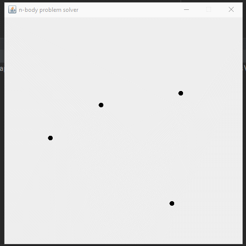
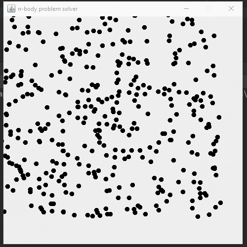
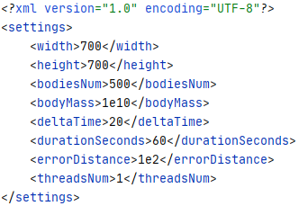

Последовательная версия:



Параллельная версия:



1. [Гравитационная задача N тел](#point1)
2. [Гравитационная задача N тел. Алгоритм решения](#point2)
3. [Гравитационная задача N тел. Графический интерфейс и настройки](#point3)
4. [Блочное умножение матриц](#blockmatrix)
5. [Производитель-и-Потребитель](#producerconsumer)
6. [Построчное сравнение двух файлов](#filediff)
7. [Нахождение простых чисел](#findingprimes)

Параллельный алгоритм основан на описанном в задании последовательном алгоритме и парадигме параллельного программирования “взаимодействующие равные”.

Распределение вычислений сил притяжения тел и их координат фиксировано заранее, вычисления распределены между потоками. Каждый поток обращается к так называемому “портфелю задач”.

В реализации алгоритма, такой портфель задач представлен в виде двух двухмерных массивов ```recalcingCallables``` и ```movingCallables``` класса ```NbodySolver``` (в терминах языках Java – массивы массивов). Количество строк массивов соответствует номеру потока, количество столбцов фиксировано – 2 столбца – первый столбец соответствует началу диапазона тел, второй – концу, иначе говоря, каждая строка содержит диапазон номеров тел, который будет обрабатывать поток, соответствующий строке массива.

Задачи делятся поровну между потоками, участвующими в вычислениях. Разбиение на задачи происходит в конструкторе класса ```NbodySolver```. Массив ```recalcingCallables``` – хранит задачи на вычисление силы гравитационного взаимодействия для каждого тела, массив ```movingCallables``` – задачи на вычисление изменения координаты положения каждого тела в соответствие с действующей на тело силы гравитационного взаимодействия.

## Гравитационная задача N тел <a name="point1"></a>

Изучение различных парадигм параллельного программирования и моделей взаимодействия параллельных процессов
.

С использованием одной из моделей взаимодействия параллельных процессов разработать параллельную программу моделирования гравитационного взаимодействия N тел.

Программа должна визуально изображать изменение взаимного положения тел в течение некоторого интервала времени (нескольких дискретных шагов времени) под действием гравитационных сил. 
Размерами тел можно пренебречь, представив их точками.

Каждое тело имеет массу, начальное положение и скорость. 
Гравитация вызывает перемещение и ускорение тел. 
Движение системы N тел имитируется пошагово с помощью дискретных отрезков времени. 
На каждом временнóм шаге вычисляются силы, действующие на каждое тело, и обновляются скорости и положения тел.

Имитация гравитационного взаимодействия имеет следующую структуру:
```
// инициализировать тела
for ( t = t_start; t < t_finish; t = t + dt ) {
// вычислить силы
// переместить тела
}

```
Значение dt является временным шагом.

Величина силы гравитации между двумя телами i и j вычисляется по формуле:
```
F = G*mi*mj/r^2 (1)
```
где mi и mj – массы тел, а r – расстояние между ними. 
Гравитация является чрезвычайно слабым взаимодействием, поэтому значение гравитационной постоянной G очень мало: 6.67e-11.


Предположим, что все тела расположены на одной плоскости, т.е. задача является двумерной. 

В этом случае силы, ускорения, скорости и положения тел являются двумерными векторами, то есть их значения задаются парами чисел, каждое из которых определяет проекцию вектора на соответствующую координатную ось. 
Например, ускорение тела i ai=[aix, aiy].

Направление силы, действующей на тело i со стороны тела j, задается единичным вектором, направленным от тела i в сторону тела j, а силы воздействия тела i на тело j – противоположным вектором. 
Величины сил, действующих между любыми двумя телами, равны, а направления противоположны. 
После вычисления модуля силы по формуле (1) необходимо вычислить величину проекций вектора силы на координатные оси, исходя из направления действия силы. 
Вычисленные значения будут компонентами вектора силы F=[Fx, Fy].

Общая сила, действующая на тело, равна векторной сумме сил воздействия со стороны всех остальных тел.
Гравитационные силы, действующие на тело, вызывают его ускорение и перемещение. 
Ускорение тела i равно отношению общей силы F, действующей на тело, к массе тела: 
```
a = F/mi
```


Если за малый интервал времени dt ускорение ai тела i остается практически постоянным, то изменение скорости приблизительно равно:
```
dvi = ai*dt
```

Изменение положения тела есть интеграл его скорости и ускорения на интервале времени dt, который приблизительно равен:

```
dpi = vi*dt + (ai/2)*(dt)^2 = (vi + dvi/2)*dt
```
Эта формула устроена по так называемой скачкообразной (leapfrog) схеме, в которой одна половина изменения в положении тела обусловлена предыдущей скоростью, а другая – новой.

При использовании приведенных выше формул следует различать векторные и скалярные величины. Компоненты соответствующих векторов следует вычислять отдельно или использовать операции над векторами.

## Алгоритм решения <a name="point2"></a>

Код задачи вычисления сил, действующих на каждой тело – код ```RecalcingCallable``` – реализации интерфейса ```Callable```:
```
private class RecalcingCallable implements Callable<Void> {

    private final int leftIndex;
    private final int rightIndex;

    public RecalcingCallable(int leftIndex, int rightIndex) {
        this.leftIndex = leftIndex;
        this.rightIndex = rightIndex;
    }

    @Override
    public Void call() {
        double distance;
        double magnitude;
        Coords direction;

        for (int k = leftIndex; k <= rightIndex; k++) {
            for (int l = k + 1; l < b.length; l++) {
                distance = distance(b[k], b[l]);
                magnitude = (distance < errorDistance) ? 0.0 : magnitude(b[k], b[l], distance);
                direction = direction(b[k], b[l]);

                b[k].setF(
                        b[k].f().x() + magnitude * direction.x() / distance,
                        b[k].f().y() + magnitude * direction.y() / distance
                );

                synchronized (NbodySolver.this) {
                    b[l].setF(
                            b[l].f().x() - magnitude * direction.x() / distance,
                            b[l].f().y() - magnitude * direction.y() / distance
                    );
                }
            }
        }

        return null;
    }
}
```

Одна задача имеет границы (диапазон) – номера тел, для которых вычисляются силы. В цикле ```for``` для каждого тела вычисляется сила его взаимодействия с другими телами: вычисляется на основе расстояний между телами ```distance```, модуля силы взаимодействия тел с другим телом ```magnitude```, также вычисляется направления суммарной силы (представлены в виде координат).

Первое тело притягивает второе, второе тело притягивает первое с той же величиной ```magnitude```, но в противоположном направлении. Поэтому в цикле ```for``` вычисляем силу для второго тела (```b[l]```) – вычитание происходит в критической секции (захватывается монитор объекта ```NbodySolver```), поскольку другой поток может изменить силу этого тела.

Код задачи вычисления координаты тела – код ```MovingCallable``` – реализации интерфейса ```Callable```:
```
private class MovingCallable implements Callable<Void> {

    private final int leftIndex;
    private final int rightIndex;

    public MovingCallable(int rangeStart, int rangeEnd) {
        this.leftIndex = rangeStart - 1;
        this.rightIndex = rangeEnd - 1;
    }

    @Override
    public Void call() {

        Coords dv; // dv = f/m * dt
        Coords dp; // dp = (v + dv/2) * dt

        for (int i = leftIndex; i <= rightIndex; i++) {
            dv = dv(b[i], dt);
            dp = dp(b[i], dt, dv);

            b[i].setV(
                    b[i].v().x() + dv.x(),
                    b[i].v().y() + dv.y()
            );

            b[i].setP(
                    b[i].p().x() + dp.x(),
                    b[i].p().y() + dp.y()
            );

            b[i].setF(0.0, 0.0);
        }

        return null;
    }
}
```

Одна задача имеет границы (диапазон) – номера тел, для которых вычисляются их координаты. В цикле ```for``` для каждого тела вычисляется его координата при помощи формул, описанных в задании. Координата вычисляется, используя текущее значения силы, координат и скорости тела, и вычисление происходит после пересчёта вектора силы тела – значит никакой другой поток не может изменить значение координаты тела (любой другой поток вычисляется значения своего диапазона тел) – критическая секция не требуется.

Рассмотри механизм остановки потоков, при истечении множества задач. Алгоритм прекращает свою работу по истечению времени ```durationMillis```. Код метода start() класса ```Panel```:
```
public void start() {
    for (int t = 0; t <= durationMillis; t = t + solver.dt()) {
        solver.recalcBodiesCoords();
        repaint();
    }
    solver.stop();
}
```

## Графический интерфейс и настройки <a name="point3"></a>

Графический интерфейс программы представлен в виде окна, на котором отрисовываются тела (чёрная точка соответствуют координате тела в определённый момент времени) через заданный промежуток времени.

В файле settings.xml пользователь может задать настройки симуляции гравитационного взаимодействия тел и размеры окна. На рисунке приставлен скриншот содержимого файла settings.xml.



В теге ```width``` пользователь задаёт ширину окна, в ```height``` – высоту, в ```bodiesNum``` – количество тел, в ```bodyMass``` – массу тела (одинаковая для каждого тела), в ```deltaTime``` – промежуток времени, через который происходят пересчёты сил и координат тел, в ```durationSeconds``` – длительность симуляции (соответствует длительности симуляции, а не реальном времени, см. ```t_finish``` в задании), в ```errorDistance``` – расстояние обнуления силы взаимодействия (необходимо, иначе при сближении тела будут упруго отталкиваться с колоссальной силой), в threadsNum – количество потоков.

## Блочное умножение матриц <a name="blockmatrix"></a>

### Задание 1
Разработать программу умножения двух матриц C=A*B, использующую транспонирование матрицы B.

### Задание 2
Разработать программу блочного перемножения матриц для различных размеров блоков и различных типов данных элементов матрицы.

## Синхронизация параллельных процессов. Производитель-и-Потребитель <a name="producerconsumer"></a>

Изучение влияния синхронизации на производительность параллельных программ.

Разработать параллельную программу, выполняющую копирование данных из одного массива (A) в другой массив (B) с использованием промежуточного буфера. 

Программа должна состоять из двух потоков:
* первый поток – производитель – содержит исходный массив А и копирует данные из него в буфер по одному элементу;
* второй поток содержит массив В и производит чтение данных из буфера по одному элементу и запись их в массив В.

Запись в буфер возможна при наличии в нем хотя бы одного свободного элемента.
Чтение из буфера возможно при наличии в нем хотя бы одного несчитанного элемента. 

С буфером связаны два счетчика: 
* первый счётчик содержит индекс первого доступного элемента для чтения (начало данных), 
* второй счётчик содержит индекс первого доступного для записи элемента. 

Если счётчики равны, буфер пуст. Буфер циклический, то есть второй счётчик может быть меньше первого. Если второй счетчик меньше первого на 1, то буфер заполнен.

Альтернативным подходом может служить учёт только занятых элементов буфера. В этом случае первый счётчик содержит индекс первого занятого элемента, второй счётчик содержит индекс последнего занятого элемента.

## Синхронизация параллельных процессов. Построчное сравнение двух файлов <a name="filediff"></a>

Изучение влияния синхронизации на производительность параллельных программ.

Разработать параллельную программу, выполняющую сравнение двух файлов (по аналогии с утилитой diff). Программа должна построчно сравнивать два текстовых файла и выводить на стандартный вывод номера и значения отличающихся строк. 

Если один из файлов длиннее другого, то программа должна вывести каждую дополнительную строку более длинного файла. 

Программа должна состоять из трёх потоков: 
* по одному потоку на построчное чтение каждого файла 
* и один поток на сравнение двух считанных строк. 

Строки из разных файлов могут читаться одновременно, но сравнение происходит, когда считаны обе строки с одинаковыми номерами. Пока процесс, сравнивающий строки, не выполнит сравнение, процессы-читатели ждут и не читают очередные строки.

## Модели взаимодействия параллельных процессов. Нахождение простых чисел <a name="findingprimes"></a>

Изучение различных парадигм параллельного программирования и моделей взаимодействия параллельных процессов.

С использованием одной из моделей взаимодействия параллельных процессов разработать параллельную программу нахождения всех простых чисел в диапазоне от 1 до N. Целое число X>1 называется простым, если оно делится без остатка только на X и на 1. Любое целое число Y>1 можно представить в виде произведения простых чисел.

Программа должна работать с любым количеством потоков, задаваемым пользователем. Программа должна реализовывать следующий алгоритм:
1) диапазон [1, N] разбивается на P частей, где P — количество потоков или процессов параллельной программы;
2) каждый поток находит простые числа в своём диапазоне, последовательно проверяя все числа внутри этого диапазона;
3) все потоки используют общий буфер (одномерный массив) для хранения найденных простых чисел;
4) каждый поток при нахождении очередного простого числа добавляет его в буфер;
5) определение того, является очередное проверяемое число простым или нет, выполняется его делением на уже найденные простые числа, находящиеся в общем буфере. 

При этом возникает задача синхронизации: при анализе очередного числа Y поток должен убедиться, что буфер содержит все числа, меньшие Y, которые могут быть его делителями. 
Поскольку некоторые из этих чисел добавляются в буфер другими потоками, текущий поток должен приостановиться и подождать, когда остальные потоки добавят все необходимые ему числа.

